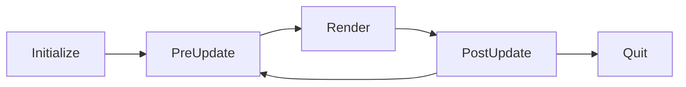

<p align="right">
  <a href="README.md">English</a> | <a href="README.ko.md"><b>한국어</b></a>
</p>


# 프로젝트 개요

본 프로젝트는 외부 수학 라이브러리나 그래픽스 API에 의존하지 않고 OpenGL 3.3 Core Specification을 참고하여 설계된 **GL-like 3D 소프트웨어 렌더러**입니다.

실제 GPU 동작을 모사한 `VirtualGPU` 계층을 중심으로, VRAM 관리, 파이프라인 상태, 셰이더 실행 흐름을 소프트웨어적으로 정의하고 구현했습니다.

또한 OpenGL Registry의 공식 헤더를 기반으로 OpenGL 3.3 스타일의 API와 드라이버 레이어를 직접 구현하여, **OpenGL과 유사한 방식으로 렌더러 및 렌더링 코드를 작성할 수 있도록 구성**되어 있습니다.

핵심 모듈(`core`, `resource`, `virtual_gpu`)은 단위 테스트로 검증되었으나, GL-like API 계층에 대한 테스트는 아직 수행되지 않아 일부 예외 케이스에서 스펙과 차이가 있을 수 있습니다.

# 렌더링 샘플
### Blinn–Phong Shading


<details>
<summary><b>Vertex Shader 코드</b></summary>

```cpp
void BLINN_PHONG_VS(size_t vertex_index, VirtualGPU::Varying& out) {
        // attribute 읽어오기
        Vector3 a_position = FetchAttribute<Vector3>(0, vertex_index);
        Vector3 a_normal = FetchAttribute<Vector3>(1, vertex_index);
        Vector4 a_tangent = FetchAttribute<Vector4>(2, vertex_index);
        Vector2 a_texcoord = FetchAttribute<Vector2>(3, vertex_index);

        // uniform 읽어오기
        Matrix4x4 u_model = FetchUniform<Matrix4x4>("u_model"_vg);
        Matrix4x4 u_view_projection = FetchUniform<Matrix4x4>("u_view_projection"_vg);

        // fragment shader에 데이터 전달
        out.vg_Position = u_view_projection * u_model * a_position.ToHomogeneous();

        Vector3 world_pos = (u_model * a_position.ToHomogeneous()).ToCartesian();
        out.Out("world_pos"_vg, world_pos);

        float handedness = a_tangent.w;
        out.OutFlat("handedness"_vg, handedness);

        Vector3 tangent = u_model.ToMatrix3x3() * Vector3(a_tangent);
        out.Out("tangent"_vg, tangent);

        Vector3 normal = u_model.ToMatrix3x3() * a_normal;
        out.Out("normal"_vg, normal);

        Vector2 uv = a_texcoord;
        out.Out("uv"_vg, uv);
    }
```
</details>

<details>
<summary><b>Fragment Shader 코드</b></summary>

```cpp
void BLINN_PHONG_FS(const VirtualGPU::Fragment& in, VirtualGPU::FSOutputs& out) {
        // vertex shader output 읽어오기
        Vector3 v_world_pos = in.In<Vector3>("world_pos"_vg);
        Vector3 v_tangent = in.In<Vector3>("tangent"_vg).Normalized();
        float v_handedness = in.InFlat<float>("handedness"_vg);
        Vector3 v_normal = in.In<Vector3>("normal"_vg).Normalized();
        Vector2 v_uv = in.In<Vector2>("uv"_vg);

        // uniform 읽어오기
        int u_diffuse_sampler = FetchUniform<int>("u_diffuse_sampler"_vg);
        int u_specular_sampler = FetchUniform<int>("u_specular_sampler"_vg);
        int u_normal_sampler = FetchUniform<int>("u_normal_sampler"_vg);

        Vector3 bitangent = v_handedness * v_normal.Cross(Vector3(v_tangent));
        Matrix3x3 tbn = Matrix3x3(Vector3(v_tangent), bitangent, v_normal).Transpose();
        // normal map 샘플링
        Vector3 normal = Texture2D<Color128>(u_normal_sampler, v_uv).ToVector3();
        normal = (tbn * normal).Normalized();

        // diffuse map 샘플링
        Color128 diffuse = Texture2D<Color128>(u_diffuse_sampler, v_uv);

        // specular map 샘플링
        Color128 specular = Texture2D<Color128>(u_specular_sampler, v_uv);

        Vector3 light_dir_raw = FetchUniform<Vector3>("u_light_directions"_vg, 0);
        Vector3 L = -light_dir_raw.Normalized();
        Vector3 N = normal.Normalized();
        Vector3 V = (FetchUniform<Vector3>("u_eyePosition"_vg) - v_world_pos).Normalized();
        Vector3 H = (V + L).Normalized();

        Color128 ambient_term = Color128(0.03f, 0.03f, 0.03f);
        Color128 diffuse_term = math::Max(N.Dot(L), 0.f) * diffuse;

        float shininess = 32.0f;
        float specular_factor = math::Pow(math::Max(N.Dot(H), 0.f), shininess);
        Color128 specular_term =
            specular_factor * Color128(specular.r, specular.r, specular.r);  // load metallic as specular

        Vector3 light_color_raw = FetchUniform<Vector3>("u_light_colors"_vg, 0);
        Color128 light_color = Color128(light_color_raw.x, light_color_raw.y, light_color_raw.z);

        Color128 color = (ambient_term + diffuse_term + specular_term) * light_color;

        Color128 final_color;
        final_color.r = color.r;
        final_color.g = color.g;
        final_color.b = color.b;
        final_color.a = 1.f;

        // 0번 draw buffer에 최종 색상 출력
        out.Out(0, final_color);
    }
```
</details>

---

### PBR Shading + Shadow Mapping


<details>
<summary><b>Vertex Shader 코드</b></summary>

```cpp
void DEPTHMAP_VS(size_t vertex_index, VirtualGPU::Varying& out) {
        // attribute 읽어오기
        Vector3 a_position = FetchAttribute<Vector3>(0, vertex_index);

        // uniform 읽어오기
        Matrix4x4 u_model = FetchUniform<Matrix4x4>("u_model"_vg);
        Matrix4x4 u_view_projection = FetchUniform<Matrix4x4>("u_view_projection"_vg);

        // fragment shader에 데이터 내보내기
        out.vg_Position = u_view_projection * u_model * a_position.ToHomogeneous();
    }

void PBR_VS(size_t vertex_index, VirtualGPU::Varying& out) {
        // attribute 읽어오기
        Vector3 a_position = FetchAttribute<Vector3>(0, vertex_index);
        Vector3 a_normal = FetchAttribute<Vector3>(1, vertex_index);
        Vector4 a_tangent = FetchAttribute<Vector4>(2, vertex_index);
        Vector2 a_texcoord = FetchAttribute<Vector2>(3, vertex_index);

        // uniform 읽어오기
        Matrix4x4 u_model = FetchUniform<Matrix4x4>("u_model"_vg);
        Matrix4x4 u_view = FetchUniform<Matrix4x4>("u_view"_vg);
        Matrix4x4 u_projection = FetchUniform<Matrix4x4>("u_projection"_vg);
        Matrix4x4 u_light_view_projection = FetchUniform<Matrix4x4>("u_light_view_projection"_vg);

        // fragment shader에 데이터 내보내기
        out.vg_Position = u_projection * u_view * u_model * a_position.ToHomogeneous();

        Vector3 world_pos = (u_model * a_position.ToHomogeneous()).ToCartesian();
        out.Out("world_pos"_vg, world_pos);

        float handedness = a_tangent.w;
        out.OutFlat("handedness"_vg, handedness);

        Vector3 tangent = u_model.ToMatrix3x3() * Vector3(a_tangent);
        out.Out("tangent"_vg, tangent);

        Vector3 normal = u_model.ToMatrix3x3() * a_normal;
        out.Out("normal"_vg, normal);

        Vector2 uv = a_texcoord;
        out.Out("uv"_vg, uv);

        Vector4 light_space_pos = u_light_view_projection * u_model * a_position.ToHomogeneous();
        out.Out("light_space_pos"_vg, light_space_pos);
    }
```
</details>

<details>
<summary><b>Fragment Shader 코드</b></summary>

```cpp
void DEPTHMAP_FS(const VirtualGPU::Fragment& in, VirtualGPU::FSOutputs& out) {
        (void)in;
        (void)out;
    }

void PBR_FS(const VirtualGPU::Fragment& in, VirtualGPU::FSOutputs& out) {
         // vertex shader output 읽어오기
        Vector3 v_world_pos = in.In<Vector3>("world_pos"_vg);
        Vector3 v_tangent = in.In<Vector3>("tangent"_vg).Normalized();
        float v_handedness = in.InFlat<float>("handedness"_vg);
        Vector3 v_normal = in.In<Vector3>("normal"_vg).Normalized();
        Vector2 v_uv = in.In<Vector2>("uv"_vg);
        Vector4 v_light_space_pos = in.In<Vector4>("light_space_pos"_vg);

        // uniform 읽어오기
        int u_normal_sampler = FetchUniform<int>("u_normal_sampler"_vg);
        int u_albedo_sampler = FetchUniform<int>("u_albedo_sampler"_vg);
        int u_metallic_roughness_sampler = FetchUniform<int>("u_metallic_roughness_sampler"_vg);
        int u_emission_sampler = FetchUniform<int>("u_emission_sampler"_vg);
        int u_ao_sampler = FetchUniform<int>("u_ao_sampler"_vg);
        int u_depthmap_sampler = FetchUniform<int>("u_depthmap_sampler"_vg);

        Vector3 bitangent = v_handedness * v_normal.Cross(Vector3(v_tangent));
        Matrix3x3 tbn = Matrix3x3(Vector3(v_tangent), bitangent, v_normal).Transpose();
        // normal map 샘플링
        Vector3 normal = Texture2D<Color128>(u_normal_sampler, v_uv).ToVector3();
        normal = (tbn * normal).Normalized();

        // albedo map 샘플링
         Color128 albedo = Texture2D<Color128>(u_albedo_sampler, v_uv);
        albedo = albedo.sRGBToLinear();

        // metallic roughness map 샘플링
        Color128 metallic_roughness = Texture2D<Color128>(u_metallic_roughness_sampler, v_uv);

        // emission map 샘플링
        Color128 emission = Texture2D<Color128>(u_emission_sampler, v_uv);
        emission = emission.sRGBToLinear();

        // ao map 샘플링
        Color128 ao = Texture2D<Color128>(u_ao_sampler, v_uv);

        // uniform 읽어오기
        Vector3 u_light_positions[1];
        u_light_positions[0] = FetchUniform<Vector3>("u_light_positions"_vg, 0);

        Vector3 u_light_colors[1];
        u_light_colors[0] = FetchUniform<Vector3>("u_light_colors"_vg, 0);

        Vector3 u_eye_position = FetchUniform<Vector3>("u_eye_position"_vg);

        Vector3 N = normal.Normalized();
        Vector3 V = (u_eye_position - v_world_pos).Normalized();

        Vector3 F0 = Vector3(0.04f, 0.04f, 0.04f);
        F0 = F0 * (1.f - metallic_roughness.b) + Vector3(albedo.r, albedo.g, albedo.b) * metallic_roughness.b;

        Vector3 Lo = Vector3(0.f, 0.f, 0.f);

        for (int i = 0; i < 1; i++) {
            Vector3 L = (u_light_positions[i] - v_world_pos).Normalized();
            Vector3 H = (V + L).Normalized();
            float distance = (u_light_positions[i] - v_world_pos).Magnitude();
            float attenuation = 1.f / (distance * distance);
            Vector3 radiance = u_light_colors[i] * attenuation;

            float NDF = DistributionGGX(N, H, metallic_roughness.g);
            float G = GeometrySmith(N, V, L, metallic_roughness.g);
            Vector3 F = FresnelSchlick(math::Max(H.Dot(V), 0.f), F0);

            Vector3 kS = F;
            Vector3 kD = Vector3(1.f, 1.f, 1.f) - kS;
            kD *= 1.f - metallic_roughness.b;

            Vector3 numerator = NDF * G * F;
            float denominator = 4.f * math::Max(N.Dot(V), 0.f) * math::Max(N.Dot(L), 0.f) + 0.0001f;
            Vector3 specular = numerator / denominator;

            float NdotL = math::Max(N.Dot(L), 0.f);

            float shadow = CalculateShadow(u_depthmap_sampler, v_light_space_pos, N, L);

            Lo +=
                (kD * Vector3(albedo.r, albedo.g, albedo.b) / math::PI + specular) * radiance * NdotL * (1.f - shadow);
        }

        Vector3 up = Vector3(0.0f, 1.0f, 0.0f);

        float sky_weight = math::Max(N.Dot(up) * 0.5f + 0.5f, 0.0f);

        Vector3 ground_color = Vector3(0.2f, 0.12f, 0.08f);
        Vector3 sky_color = Vector3(0.2f, 0.4f, 0.8f);

        Vector3 hemi_ambient = ground_color * (1.f - sky_weight) + sky_color * sky_weight;

        Vector3 ambient = hemi_ambient * Vector3(albedo.r, albedo.g, albedo.b) * ao.r;

        Vector3 color = ambient + Lo + Vector3(emission.r, emission.g, emission.b);

        Vector3 R = (N * 2.0f * math::Max(N.Dot(V), 0.0f) - V).Normalized();
        float reflect_weight = math::Max(R.Dot(up) * 0.5f + 0.5f, 0.0f);
        Vector3 fake_reflection = (ground_color * (1.f - reflect_weight) + sky_color * reflect_weight) * 2.0f;

        color += fake_reflection * F0 * (1.0f - metallic_roughness.g);

        color = color / (color + Vector3(1.f, 1.f, 1.f));

        Color128 final_color;
        final_color.r = color.x;
        final_color.g = color.y;
        final_color.b = color.z;
        final_color.a = 1.f;

        // 0번 draw buffer에 최종 색상 출력
        out.Out(0, final_color.LinearTosRGB());
    }
```
</details>


# 빌드 환경 및 방법

### 🛠️ 빌드 환경
- OS: Windows 10 / 11
- Compiler:
  - MSVC (`cl`)
  - Clang (`clang`, `clang++`)
- CMake: 3.20 이상
- C++ Standard: C++17

---

### 📦 빌드 파일 생성
- MSVC (Visual Studio 2022)
```
cmake -S . -B <디렉토리 이름> -G "Visual Studio 17 2022"
```
- Clang + Ninja (Debug)
```
cmake -S . -B <디렉토리 이름> -G Ninja -DCMAKE_C_COMPILER=clang -DCMAKE_CXX_COMPILER=clang++ -DCMAKE_BUILD_TYPE=Debug
```
- Clang + Ninja (Release)
```
cmake -S . -B <디렉토리 이름> -G Ninja -DCMAKE_C_COMPILER=clang -DCMAKE_CXX_COMPILER=clang++ -DCMAKE_BUILD_TYPE=Release
```

---

### 🔧 빌드
- MSVC (Debug)
```
cmake --build <디렉토리 이름> --config Debug
```
- MSVC (Release)
```
cmake --build <디렉토리 이름> --config Release
```
- Clang + Ninja (Debug/Release)
```
cmake --build <디렉토리 이름>
```

# 프로젝트 구조


# 렌더러 작성 방법
본 프로젝트는 platform 계층에서 하나의 렌더러 객체를 참조하고, 해당 렌더러가 제공하는 공용 API를 프레임 단위로 호출하는 구조로 동작합니다.

렌더러는 다음과 같은 프레임 라이프사이클을 따라 실행됩니다.




사용자는 셰이더를 작성한 뒤, 이를 사용하는 렌더러 클래스를 정의하고, 해당 렌더러를 renderer adapter에 등록함으로써 직접 정의한 렌더링 로직에 따라 화면을 출력할 수 있습니다.
> ⚠️ **주의**
> 
> 본 프로젝트는 엄격한 컴파일러 옵션과 `clang-tidy`를 사용하여 핵심 모듈에 대해 강한 정적 분석을 수행합니다.
> 
> 사용자 정의 렌더러에 동일한 분석 규칙을 강제하지 않기 위해 렌더러 및 셰이더 코드는 `custom_renderers` 모듈에 작성하는 것을 권장합니다.

렌더러 클래스는 renderer 모듈의 `Renderer` 클래스를 상속받아 구현해야 하며, 각 가상 함수는 다음과 같은 역할을 가집니다.

---

### Initialize()
- VirtualGPU의 초기 상태를 설정합니다.<br><br>
- 카메라, 광원, 렌더링할 모델 인스턴스를 생성합니다.<br><br>
- 렌더링할 모델을 로드하여 VirtualGPU에 업로드합니다.<br><br>
- 모델 로드는 core 모듈의 `ResourceLoader::LoadModel()`을 통해 수행할 수 있습니다.<br><br>
- 로드된 모델은 Renderer가 소유한 `resource_manager_`에 등록됩니다.<br><br>
- 모델은 `ResourceID`를 통해 참조됩니다.<br><br>
- 현재 프로젝트는 `obj`, `gltf` 파일 로드를 지원합니다.<br><br>
- 모델 경로는 `assets` 디렉토리를 기준으로 한 상대 경로여야 합니다.

---

### <b>PreUpdate(float delta_time)</b>
- 입력 및 시간 변화에 따른 상태 업데이트를 수행합니다.<br><br>
- `Renderer` 클래스는 다음과 같은 입력 상태 멤버를 제공합니다:<br><br>
  - `input_states_`: 키보드 및 마우스 버튼의 상태<br><br>
  - `mouse_x_`, `mouse_y_`: 현재 마우스 커서의 위치 (렌더러 윈도우 기준 상대 좌표)<br><br>
  - `mouse_delta_x_`, `mouse_delta_y_`: 이전 프레임 대비 마우스 이동량<br><br>
  - `mouse_wheel_delta_`: 현재 프레임에서 발생한 마우스 휠 변화량

---

### <b>Render()</b>
- 카메라, 광원, 모델 인스턴스를 기반으로 드로우 콜을 수행합니다.<br><br>
- 실제 렌더링 로직은 이 함수에서 구현됩니다.

---

### <b>PostUpdate(float delta_time)</b>
- 렌더링 이후의 상태 업데이트를 수행합니다.<br><br>
- `mouse_wheel_delta_`는 이벤트 성격의 값이므로 이 함수에서 반드시 초기화해야 합니다.<br><br>
- 초기화하지 않을 경우, 휠 입력이 지속적으로 발생한 것처럼 동작할 수 있습니다.

---

### <b>Quit()</b>
- 렌더러 종료 시 한 번 호출됩니다.<br><br>
- 리소스 정리 및 종료 처리를 수행합니다.

---
# 셰이더 작성 방법

본 프로젝트에서 사용되는 Vertex Shader와 Fragment Shader는 반드시 아래와 같은 시그니처를 따라야 합니다.

## Vertex Shader
- **시그니처**: `(void)(size_t, VirtualGPU::Varying&)`
- `size_t`  
  현재 Vertex Shader에서 처리 중인 vertex의 index를 의미합니다.
- `VirtualGPU::Varying&`  
  Fragment Shader로 전달할 데이터를 추상화한 클래스로, 관련 API를 통해 값을 기록할 수 있습니다.

## Fragment Shader
- **시그니처**: `(void)(const VirtualGPU::Fragment&, VirtualGPU::FSOutputs&)`
- `const VirtualGPU::Fragment&`  
  Vertex Shader에서 전달된 보간된 데이터를 추상화한 클래스로, 읽기 전용 API를 제공합니다.
- `VirtualGPU::FSOutputs&`  
  Fragment Shader의 최종 출력 값을 기록하기 위한 클래스로, 관련 API를 통해 값을 기록할 수 있습니다.

셰이더 내부에서 attribute, uniform 접근 또는 텍스처 샘플링은 `shader_api.h` 헤더에 정의된 API를 통해 수행해야 합니다.

> ⚠️ **주의**
>
> 본 프로젝트는 런타임 문자열 처리 비용을 최소화하기 위해 문자열을 정수 값으로 변환하는 user-defined literal을 제공합니다.
>
> 문자열 리터럴 뒤에 `_vg` 접미사를 붙여 사용할 수 있으며, GL-like API는 문자열 대신 해당 변환된 정수 값을 인자로 받도록 설계되어 있습니다.

# GL-like API

본 프로젝트의 GL-like API는 Khronos Group의 공식 OpenGL API 레포지토리인 **OpenGL-Registry**의 `glcorearb.h` 헤더를 참고하여 구현되었습니다.

API의 형태와 ENUM 구성은 OpenGL 3.3 Core Specification을 따르되, 접두어는 `gl`, `GL_` 대신 `vg`, `VG_`를 사용합니다.

현재 구현되어 있는 API 목록과 사용 가능한 ENUM에 대해서는 아래 내용을 참고해 주세요.

GL-like API를 확장하거나 추가적인 OpenGL 기능을 구현하는 데 관심이 있다면, 기여는 언제든지 환영합니다.

<details>
<summary><b>구현/미구현 API 목록</b></summary>

### 1.0 API
- [x] CullFace
- [x] FrontFace
- [ ] Hint
- [ ] LineWidth
- [ ] PointSize
- [x] PolygonMode
- [x] Scissor
- [x] TexParameterf
- [x] TexParameterfv
- [x] TexParameteri
- [x] TexParameteriv
- [x] TexImage1D
- [x] TexImage2D
- [x] DrawBuffer
- [x] Clear
- [x] ClearColor
- [x] ClearStencil
- [x] ClearDepth
- [x] StencilMask
- [x] ColorMask
- [x] DepthMask
- [x] Disable
- [x] Enable
- [x] Finish
- [x] Flush
- [x] BlendFunc
- [ ] LogicOp
- [x] StencilFunc
- [x] StencilOp
- [x] DepthFunc
- [x] PixelStoref
- [x] PixelStorei
- [x] ReadBuffer
- [ ] ReadPixels
- [x] GetError
- [ ] GetBooleanv
- [ ] GetFloatv
- [ ] GetDoublev
- [ ] GetIntegerv
- [ ] GetString
- [x] GetTexImage
- [ ] GetTexParameterfv
- [ ] GetTexParameteriv
- [ ] GetTexLevelParameterfv
- [ ] GetTexLevelParameteriv
- [x] IsEnabled
- [x] DepthRange
- [x] Viewport

### 1.1 API
- [x] DrawArrays
- [x] DrawElements
- [ ] GetPointerv
- [x] PolygonOffset
- [ ] CopyTexImage1D
- [ ] CopyTexImage2D
- [ ] CopyTexSubImage1D
- [ ] CopyTexSubImage2D
- [x] TexSubImage1D
- [x] TexSubImage2D
- [x] BindTexture
- [x] DeleteTextures
- [x] GenTextures
- [x] IsTexture

### 1.2 API
- [x] DrawRangeElements
- [x] TexImage3D
- [x] TexSubImage3D
- [ ] CopyTexSubImage3D

### 1.3 API
- [x] ActiveTexture
- [ ] SampleCoverage
- [ ] CompressedTexImage3D
- [ ] CompressedTexImage2D
- [ ] CompressedTexImage1D
- [ ] CompressedTexSubImage3D
- [ ] CompressedTexSubImage2D
- [ ] CompressedTexSubImage1D
- [ ] GetCompressedTexImage

### 1.4 API
- [x] BlendFuncSeparate
- [x] MultiDrawArrays
- [x] MultiDrawElements
- [ ] PointParameterf
- [ ] PointParameterfv
- [ ] PointParameteri
- [ ] PointParameteriv
- [x] BlendColor
- [x] BlendEquation

### 1.5 API
- [ ] GenQueries
- [ ] DeleteQueries
- [ ] IsQuery
- [ ] BeginQuery
- [ ] EndQuery
- [ ] GetQueryiv
- [ ] GetQueryObjectiv
- [ ] GetQueryObjectuiv
- [x] BindBuffer
- [x] DeleteBuffers
- [x] GenBuffers
- [x] IsBuffer
- [x] BufferData
- [x] BufferSubData
- [ ] GetBufferSubData
- [ ] MapBuffer
- [ ] UnmapBuffer
- [ ] GetBufferParameteriv
- [ ] GetBufferPointerv

### 2.0 API
- [x] BlendEquationSeparate
- [x] DrawBuffers
- [x] StencilOpSeparate
- [x] StencilFuncSeparate
- [x] StencilMaskSeparate
- [x] AttachShader
- [x] BindAttribLocation
- [x] CompileShader
- [x] CreateProgram
- [x] CreateShader
- [x] DeleteProgram
- [x] DeleteShader
- [x] DetachShader
- [x] DisableVertexAttribArray
- [x] EnableVertexAttribArray
- [ ] GetActiveAttrib
- [ ] GetActiveUniform
- [ ] GetAttachedShaders
- [ ] GetAttribLocation
- [ ] GetProgramiv
- [ ] GetProgramInfoLog
- [ ] GetShaderiv
- [ ] GetShaderInfoLog
- [ ] GetShaderSource
- [x] GetUniformLocation
- [ ] GetUniformfv
- [ ] GetUniformiv
- [ ] GetVertexAttribdv
- [ ] GetVertexAttribfv
- [ ] GetVertexAttribiv
- [ ] GetVertexAttribPointerv
- [x] IsProgram
- [x] IsShader
- [x] LinkProgram
- [x] ShaderSource
- [x] UseProgram
- [x] Uniform1f
- [x] Uniform2f
- [x] Uniform3f
- [x] Uniform4f
- [x] Uniform1i
- [x] Uniform2i
- [x] Uniform3i
- [x] Uniform4i
- [x] Uniform1fv
- [x] Uniform2fv
- [x] Uniform3fv
- [x] Uniform4fv
- [x] Uniform1iv
- [x] Uniform2iv
- [x] Uniform3iv
- [x] Uniform4iv
- [x] UniformMatrix2fv
- [x] UniformMatrix3fv
- [x] UniformMatrix4fv
- [ ] ValidateProgram
- [x] VertexAttrib1d
- [x] VertexAttrib1dv
- [x] VertexAttrib1f
- [x] VertexAttrib1fv
- [x] VertexAttrib1s
- [x] VertexAttrib1sv
- [x] VertexAttrib2d
- [x] VertexAttrib2dv
- [x] VertexAttrib2f
- [x] VertexAttrib2fv
- [x] VertexAttrib2s
- [x] VertexAttrib2sv
- [x] VertexAttrib3d
- [x] VertexAttrib3dv
- [x] VertexAttrib3f
- [x] VertexAttrib3fv
- [x] VertexAttrib3s
- [x] VertexAttrib3sv
- [x] VertexAttrib4Nbv
- [x] VertexAttrib4Niv
- [x] VertexAttrib4Nsv
- [x] VertexAttrib4Nub
- [x] VertexAttrib4Nubv
- [x] VertexAttrib4Nuiv
- [x] VertexAttrib4Nusv
- [x] VertexAttrib4bv
- [x] VertexAttrib4d
- [x] VertexAttrib4dv
- [x] VertexAttrib4f
- [x] VertexAttrib4fv
- [x] VertexAttrib4iv
- [x] VertexAttrib4s
- [x] VertexAttrib4sv
- [x] VertexAttrib4ubv
- [x] VertexAttrib4uiv
- [x] VertexAttrib4usv
- [x] VertexAttribPointer

### 2.1 API
- [ ] UniformMatrix2x3fv
- [ ] UniformMatrix3x2fv
- [ ] UniformMatrix2x4fv
- [ ] UniformMatrix4x2fv
- [ ] UniformMatrix3x4fv
- [ ] UniformMatrix4x3fv

### 3.0 API
- [x] ColorMaski
- [ ] GetBooleani_v
- [ ] GetIntegeri_v
- [x] Enablei
- [x] Disablei
- [x] IsEnabledi
- [ ] BeginTransformFeedback
- [ ] EndTransformFeedback
- [x] BindBufferRange
- [x] BindBufferBase
- [ ] TransformFeedbackVaryings
- [ ] GetTransformFeedbackVarying
- [ ] ClampColor
- [ ] BeginConditionalRender
- [ ] EndConditionalRender
- [x] VertexAttribIPointer
- [ ] GetVertexAttribIiv
- [ ] GetVertexAttribIuiv
- [x] VertexAttribI1i
- [x] VertexAttribI2i
- [x] VertexAttribI3i
- [x] VertexAttribI4i
- [x] VertexAttribI1ui
- [x] VertexAttribI2ui
- [x] VertexAttribI3ui
- [x] VertexAttribI4ui
- [x] VertexAttribI1iv
- [x] VertexAttribI2iv
- [x] VertexAttribI3iv
- [x] VertexAttribI4iv
- [x] VertexAttribI1uiv
- [x] VertexAttribI2uiv
- [x] VertexAttribI3uiv
- [x] VertexAttribI4uiv
- [x] VertexAttribI4bv
- [x] VertexAttribI4sv
- [x] VertexAttribI4ubv
- [x] VertexAttribI4usv
- [ ] GetUniformuiv
- [x] BindFragDataLocation
- [x] GetFragDataLocation
- [x] Uniform1ui
- [x] Uniform2ui
- [x] Uniform3ui
- [x] Uniform4ui
- [x] Uniform1uiv
- [x] Uniform2uiv
- [x] Uniform3uiv
- [x] Uniform4uiv
- [ ] TexParameterIiv
- [ ] TexParameterIuiv
- [ ] GetTexParameterIiv
- [ ] GetTexParameterIuiv
- [x] ClearBufferiv
- [x] ClearBufferuiv
- [x] ClearBufferfv
- [x] ClearBufferfi
- [ ] GetStringi
- [x] IsRenderbuffer
- [x] BindRenderbuffer
- [x] DeleteRenderbuffers
- [x] GenRenderbuffers
- [x] RenderbufferStorage
- [ ] GetRenderbufferParameteriv
- [x] IsFramebuffer
- [x] BindFramebuffer
- [x] DeleteFramebuffers
- [x] GenFramebuffers
- [x] CheckFramebufferStatus
- [x] FramebufferTexture1D
- [x] FramebufferTexture2D
- [x] FramebufferTexture3D
- [x] FramebufferRenderbuffer
- [ ] GetFramebufferAttachmentParameteriv
- [ ] GenerateMipmap
- [ ] BlitFramebuffer
- [ ] RenderbufferStorageMultisample
- [ ] FramebufferTextureLayer
- [ ] MapBufferRange
- [ ] FlushMappedBufferRange
- [x] BindVertexArray
- [x] DeleteVertexArrays
- [x] GenVertexArrays
- [x] IsVertexArray

### 3.1 API
- [ ] DrawArraysInstanced
- [ ] DrawElementsInstanced
- [ ] TexBuffer
- [ ] PrimitiveRestartIndex
- [ ] CopyBufferSubData
- [ ] GetUniformIndices
- [ ] GetActiveUniformsiv
- [ ] GetActiveUniformName
- [ ] GetUniformBlockIndex
- [ ] GetActiveUniformBlockiv
- [ ] GetActiveUniformBlockName
- [ ] UniformBlockBinding

### 3.2 API
- [ ] DrawElementsBaseVertex
- [ ] DrawRangeElementsBaseVertex
- [ ] DrawElementsInstancedBaseVertex
- [ ] MultiDrawElementsBaseVertex
- [ ] ProvokingVertex
- [ ] FenceSync
- [ ] IsSync
- [ ] DeleteSync
- [ ] ClientWaitSync
- [ ] WaitSync
- [ ] GetInteger64v
- [ ] GetSynciv
- [ ] GetInteger64i_v
- [ ] GetBufferParameteri64v
- [x] FramebufferTexture
- [ ] TexImage2DMultisample
- [ ] TexImage3DMultisample
- [ ] GetMultisamplefv
- [ ] SampleMaski

### 3.3 API
- [ ] BindFragDataLocationIndexed
- [ ] GetFragDataIndex
- [x] GenSamplers
- [x] DeleteSamplers
- [x] IsSampler
- [x] BindSampler
- [x] SamplerParameteri
- [x] SamplerParameteriv
- [x] SamplerParameterf
- [x] SamplerParameterfv
- [ ] SamplerParameterIiv
- [ ] SamplerParameterIuiv
- [ ] GetSamplerParameteriv
- [ ] GetSamplerParameterIiv
- [ ] GetSamplerParameterfv
- [ ] GetSamplerParameterIuiv
- [ ] QueryCounter
- [ ] GetQueryObjecti64v
- [ ] GetQueryObjectui64v
- [ ] VertexAttribDivisor
- [ ] VertexAttribP1ui
- [ ] VertexAttribP1uiv
- [ ] VertexAttribP2ui
- [ ] VertexAttribP2uiv
- [ ] VertexAttribP3ui
- [ ] VertexAttribP3uiv
- [ ] VertexAttribP4ui
- [ ] VertexAttribP4uiv

</details>

<details>
<summary><b>사용 가능 ENUM 목록</b></summary>

#### Buffer Clear Bits
- DEPTH_BUFFER_BIT
- STENCIL_BUFFER_BIT
- COLOR_BUFFER_BIT

#### Boolean Values
- FALSE
- TRUE

#### Primitive Types
- POINTS
- LINES
- LINE_STRIP
- TRIANGLES
- TRIANGLE_STRIP

#### Comparison Functions
- NEVER
- LESS
- EQUAL
- LEQUAL
- GREATER
- NOTEQUAL
- GEQUAL
- ALWAYS

#### Blend Factors
- ZERO
- ONE
- SRC_COLOR
- ONE_MINUS_SRC_COLOR
- SRC_ALPHA
- ONE_MINUS_SRC_ALPHA
- DST_COLOR
- ONE_MINUS_DST_COLOR
- DST_ALPHA
- ONE_MINUS_DST_ALPHA
- SRC_ALPHA_SATURATE
- CONSTANT_COLOR
- ONE_MINUS_CONSTANT_COLOR
- CONSTANT_ALPHA
- ONE_MINUS_CONSTANT_ALPHA

#### Blend Equations
- FUNC_ADD
- FUNC_SUBTRACT
- FUNC_REVERSE_SUBTRACT
- MIN
- MAX

#### Face Selection / Orientation
- FRONT
- BACK
- FRONT_AND_BACK
- CW
- CCW

#### Error Codes
- NO_ERROR
- INVALID_ENUM
- INVALID_VALUE
- INVALID_OPERATION
- OUT_OF_MEMORY

#### Polygon State
- POLYGON_MODE
- POINT
- LINE
- FILL
- POLYGON_OFFSET_POINT
- POLYGON_OFFSET_LINE
- POLYGON_OFFSET_FILL

#### Enable / Disable Capabilities
- CULL_FACE
- DEPTH_TEST
- STENCIL_TEST
- BLEND
- SCISSOR_TEST

#### Stencil Operations
- KEEP
- REPLACE
- INCR
- DECR
- INCR_WRAP
- DECR_WRAP

#### Draw / Read Buffers
- DRAW_BUFFER
- READ_BUFFER
- DRAW_BUFFER0 … DRAW_BUFFER31
- MAX_DRAW_BUFFERS

#### Texture Targets
- TEXTURE_1D
- TEXTURE_2D
- TEXTURE_3D
- PROXY_TEXTURE_1D
- PROXY_TEXTURE_2D
- PROXY_TEXTURE_3D
- TEXTURE_BUFFER

#### Texture Units
- TEXTURE0 … TEXTURE31

#### Texture Parameters
- TEXTURE_MIN_FILTER
- TEXTURE_MAG_FILTER
- TEXTURE_WRAP_S
- TEXTURE_WRAP_T
- TEXTURE_WRAP_R
- TEXTURE_BORDER_COLOR
- TEXTURE_SWIZZLE_R
- TEXTURE_SWIZZLE_G
- TEXTURE_SWIZZLE_B
- TEXTURE_SWIZZLE_A
- TEXTURE_SWIZZLE_RGBA

#### Texture Filtering / Wrapping Modes
- NEAREST
- LINEAR
- REPEAT
- MIRRORED_REPEAT
- CLAMP_TO_EDGE
- CLAMP_TO_BORDER

#### Pixel / Internal Formats
- RED
- RG
- RGB
- RGBA
- BGR
- BGRA
- DEPTH_COMPONENT
- DEPTH
- STENCIL
- DEPTH_STENCIL
- COLOR

#### Data Types
- BYTE
- UNSIGNED_BYTE
- SHORT
- UNSIGNED_SHORT
- INT
- UNSIGNED_INT
- FLOAT
- DOUBLE
- HALF_FLOAT

#### Buffer Objects
- ARRAY_BUFFER
- ELEMENT_ARRAY_BUFFER
- UNIFORM_BUFFER

#### Buffer Usage Hints
- STREAM_DRAW
- STREAM_READ
- STREAM_COPY
- STATIC_DRAW
- STATIC_READ
- STATIC_COPY
- DYNAMIC_DRAW
- DYNAMIC_READ
- DYNAMIC_COPY

#### Vertex Attributes
- VERTEX_ARRAY
- MAX_VERTEX_ATTRIBS

#### Shader Types
- VERTEX_SHADER
- FRAGMENT_SHADER

#### Framebuffers & Renderbuffers
- FRAMEBUFFER
- RENDERBUFFER
- READ_FRAMEBUFFER
- DRAW_FRAMEBUFFER
- FRAMEBUFFER_COMPLETE
- FRAMEBUFFER_UNDEFINED
- FRAMEBUFFER_UNSUPPORTED
- FRAMEBUFFER_INCOMPLETE_ATTACHMENT
- FRAMEBUFFER_INCOMPLETE_MISSING_ATTACHMENT
- FRAMEBUFFER_INCOMPLETE_DRAW_BUFFER
- FRAMEBUFFER_INCOMPLETE_READ_BUFFER
- FRAMEBUFFER_DEFAULT
- MAX_RENDERBUFFER_SIZE

#### Framebuffer Attachments
- COLOR_ATTACHMENT0 … COLOR_ATTACHMENT31
- DEPTH_ATTACHMENT
- STENCIL_ATTACHMENT
- DEPTH_STENCIL_ATTACHMENT
- MAX_COLOR_ATTACHMENTS
</details>

# Reference
