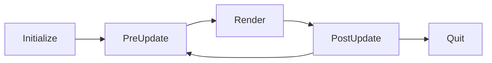

<p align="right">
  <a href="README.md"><b>English</b></a> | <a href="README.ko.md">한국어</a>
</p>


# Project Overview

This project is a **GL-like 3D software renderer** designed based on the OpenGL 3.3 Core Specification, without relying on any external math libraries or graphics APIs.

Centered around a `VirtualGPU` layer that emulates real GPU behavior, the renderer defines and implements VRAM-backed resource management, pipeline state handling, and shader execution flow entirely in software.

In addition, the project directly implements an OpenGL 3.3–style API and driver layer based on the official OpenGL Registry headers, enabling developers to write renderers and rendering code in a manner similar to OpenGL.

The core modules (`core`, `resource`, `virtual_gpu`) are validated through unit tests.  
However, the GL-like API layer has not yet been fully covered by tests, and some behaviors may differ from the specification in certain edge cases.

# Rendering Samples
### Blinn–Phong Shading


<details>
<summary><b>Vertex Shader Code</b></summary>

```cpp
void BLINN_PHONG_VS(size_t vertex_index, VirtualGPU::Varying& out) {
        // fetch attributes
        Vector3 a_position = FetchAttribute<Vector3>(0, vertex_index);
        Vector3 a_normal = FetchAttribute<Vector3>(1, vertex_index);
        Vector4 a_tangent = FetchAttribute<Vector4>(2, vertex_index);
        Vector2 a_texcoord = FetchAttribute<Vector2>(3, vertex_index);

        // fetch uniforms
        Matrix4x4 u_model = FetchUniform<Matrix4x4>("u_model"_vg);
        Matrix4x4 u_view_projection = FetchUniform<Matrix4x4>("u_view_projection"_vg);

        // pass data to fragment shader
        out.vg_Position = u_view_projection * u_model * a_position.ToHomogeneous();

        Vector3 world_pos = (u_model * a_position.ToHomogeneous()).ToCartesian();
        out.Out("world_pos"_vg, world_pos);

        float handedness = a_tangent.w;
        out.OutFlat("handedness"_vg, handedness);

        Vector3 tangent = u_model.ToMatrix3x3() * Vector3(a_tangent);
        out.Out("tangent"_vg, tangent);

        Vector3 normal = u_model.ToMatrix3x3() * a_normal;
        out.Out("normal"_vg, normal);

        Vector2 uv = a_texcoord;
        out.Out("uv"_vg, uv);
    }
```
</details>

<details>
<summary><b>Fragment Shader Code</b></summary>

```cpp
void BLINN_PHONG_FS(const VirtualGPU::Fragment& in, VirtualGPU::FSOutputs& out) {
        // read vertex shader outputs
        Vector3 v_world_pos = in.In<Vector3>("world_pos"_vg);
        Vector3 v_tangent = in.In<Vector3>("tangent"_vg).Normalized();
        float v_handedness = in.InFlat<float>("handedness"_vg);
        Vector3 v_normal = in.In<Vector3>("normal"_vg).Normalized();
        Vector2 v_uv = in.In<Vector2>("uv"_vg);

        // fetch uniforms
        int u_diffuse_sampler = FetchUniform<int>("u_diffuse_sampler"_vg);
        int u_specular_sampler = FetchUniform<int>("u_specular_sampler"_vg);
        int u_normal_sampler = FetchUniform<int>("u_normal_sampler"_vg);

        Vector3 bitangent = v_handedness * v_normal.Cross(Vector3(v_tangent));
        Matrix3x3 tbn = Matrix3x3(Vector3(v_tangent), bitangent, v_normal).Transpose();
        // normal map sampling
        Vector3 normal = Texture2D<Color128>(u_normal_sampler, v_uv).ToVector3();
        normal = (tbn * normal).Normalized();

        // diffuse map sampling
        Color128 diffuse = Texture2D<Color128>(u_diffuse_sampler, v_uv);

        // specular map sampling
        Color128 specular = Texture2D<Color128>(u_specular_sampler, v_uv);

        Vector3 light_dir_raw = FetchUniform<Vector3>("u_light_directions"_vg, 0);
        Vector3 L = -light_dir_raw.Normalized();
        Vector3 N = normal.Normalized();
        Vector3 V = (FetchUniform<Vector3>("u_eyePosition"_vg) - v_world_pos).Normalized();
        Vector3 H = (V + L).Normalized();

        Color128 ambient_term = Color128(0.03f, 0.03f, 0.03f);
        Color128 diffuse_term = math::Max(N.Dot(L), 0.f) * diffuse;

        float shininess = 32.0f;
        float specular_factor = math::Pow(math::Max(N.Dot(H), 0.f), shininess);
        Color128 specular_term =
            specular_factor * Color128(specular.r, specular.r, specular.r);  // load metallic as specular

        Vector3 light_color_raw = FetchUniform<Vector3>("u_light_colors"_vg, 0);
        Color128 light_color = Color128(light_color_raw.x, light_color_raw.y, light_color_raw.z);

        Color128 color = (ambient_term + diffuse_term + specular_term) * light_color;

        Color128 final_color;
        final_color.r = color.r;
        final_color.g = color.g;
        final_color.b = color.b;
        final_color.a = 1.f;

        // output final color to draw buffer 0
        out.Out(0, final_color);
    }
```
</details>

---

### PBR Shading + Shadow Mapping


<details>
<summary><b>Vertex Shader Code</b></summary>

```cpp
void DEPTHMAP_VS(size_t vertex_index, VirtualGPU::Varying& out) {
        // fetch attributes
        Vector3 a_position = FetchAttribute<Vector3>(0, vertex_index);

        // fetch uniforms
        Matrix4x4 u_model = FetchUniform<Matrix4x4>("u_model"_vg);
        Matrix4x4 u_view_projection = FetchUniform<Matrix4x4>("u_view_projection"_vg);

        // pass data to fragment shader
        out.vg_Position = u_view_projection * u_model * a_position.ToHomogeneous();
    }

void PBR_VS(size_t vertex_index, VirtualGPU::Varying& out) {
        // fetch attributes
        Vector3 a_position = FetchAttribute<Vector3>(0, vertex_index);
        Vector3 a_normal = FetchAttribute<Vector3>(1, vertex_index);
        Vector4 a_tangent = FetchAttribute<Vector4>(2, vertex_index);
        Vector2 a_texcoord = FetchAttribute<Vector2>(3, vertex_index);

        // fetch uniforms
        Matrix4x4 u_model = FetchUniform<Matrix4x4>("u_model"_vg);
        Matrix4x4 u_view = FetchUniform<Matrix4x4>("u_view"_vg);
        Matrix4x4 u_projection = FetchUniform<Matrix4x4>("u_projection"_vg);
        Matrix4x4 u_light_view_projection = FetchUniform<Matrix4x4>("u_light_view_projection"_vg);

        // pass data to fragment shader
        out.vg_Position = u_projection * u_view * u_model * a_position.ToHomogeneous();

        Vector3 world_pos = (u_model * a_position.ToHomogeneous()).ToCartesian();
        out.Out("world_pos"_vg, world_pos);

        float handedness = a_tangent.w;
        out.OutFlat("handedness"_vg, handedness);

        Vector3 tangent = u_model.ToMatrix3x3() * Vector3(a_tangent);
        out.Out("tangent"_vg, tangent);

        Vector3 normal = u_model.ToMatrix3x3() * a_normal;
        out.Out("normal"_vg, normal);

        Vector2 uv = a_texcoord;
        out.Out("uv"_vg, uv);

        Vector4 light_space_pos = u_light_view_projection * u_model * a_position.ToHomogeneous();
        out.Out("light_space_pos"_vg, light_space_pos);
    }
```
</details>

<details>
<summary><b>Fragment Shader Code</b></summary>

```cpp
void DEPTHMAP_FS(const VirtualGPU::Fragment& in, VirtualGPU::FSOutputs& out) {
        (void)in;
        (void)out;
    }

void PBR_FS(const VirtualGPU::Fragment& in, VirtualGPU::FSOutputs& out) {
        // read vertex shader outputs
        Vector3 v_world_pos = in.In<Vector3>("world_pos"_vg);
        Vector3 v_tangent = in.In<Vector3>("tangent"_vg).Normalized();
        float v_handedness = in.InFlat<float>("handedness"_vg);
        Vector3 v_normal = in.In<Vector3>("normal"_vg).Normalized();
        Vector2 v_uv = in.In<Vector2>("uv"_vg);
        Vector4 v_light_space_pos = in.In<Vector4>("light_space_pos"_vg);

        // fetch uniforms
        int u_normal_sampler = FetchUniform<int>("u_normal_sampler"_vg);
        int u_albedo_sampler = FetchUniform<int>("u_albedo_sampler"_vg);
        int u_metallic_roughness_sampler = FetchUniform<int>("u_metallic_roughness_sampler"_vg);
        int u_emission_sampler = FetchUniform<int>("u_emission_sampler"_vg);
        int u_ao_sampler = FetchUniform<int>("u_ao_sampler"_vg);
        int u_depthmap_sampler = FetchUniform<int>("u_depthmap_sampler"_vg);

        Vector3 bitangent = v_handedness * v_normal.Cross(Vector3(v_tangent));
        Matrix3x3 tbn = Matrix3x3(Vector3(v_tangent), bitangent, v_normal).Transpose();
        // normal map sampling
        Vector3 normal = Texture2D<Color128>(u_normal_sampler, v_uv).ToVector3();
        normal = (tbn * normal).Normalized();

        // albedo map sampling
         Color128 albedo = Texture2D<Color128>(u_albedo_sampler, v_uv);
        albedo = albedo.sRGBToLinear();

        // metallic roughness map sampling
        Color128 metallic_roughness = Texture2D<Color128>(u_metallic_roughness_sampler, v_uv);

        // emission map sampling
        Color128 emission = Texture2D<Color128>(u_emission_sampler, v_uv);
        emission = emission.sRGBToLinear();

        // ao map sampling
        Color128 ao = Texture2D<Color128>(u_ao_sampler, v_uv);

        // fetch uniforms
        Vector3 u_light_positions[1];
        u_light_positions[0] = FetchUniform<Vector3>("u_light_positions"_vg, 0);

        Vector3 u_light_colors[1];
        u_light_colors[0] = FetchUniform<Vector3>("u_light_colors"_vg, 0);

        Vector3 u_eye_position = FetchUniform<Vector3>("u_eye_position"_vg);

        Vector3 N = normal.Normalized();
        Vector3 V = (u_eye_position - v_world_pos).Normalized();

        Vector3 F0 = Vector3(0.04f, 0.04f, 0.04f);
        F0 = F0 * (1.f - metallic_roughness.b) + Vector3(albedo.r, albedo.g, albedo.b) * metallic_roughness.b;

        Vector3 Lo = Vector3(0.f, 0.f, 0.f);

        for (int i = 0; i < 1; i++) {
            Vector3 L = (u_light_positions[i] - v_world_pos).Normalized();
            Vector3 H = (V + L).Normalized();
            float distance = (u_light_positions[i] - v_world_pos).Magnitude();
            float attenuation = 1.f / (distance * distance);
            Vector3 radiance = u_light_colors[i] * attenuation;

            float NDF = DistributionGGX(N, H, metallic_roughness.g);
            float G = GeometrySmith(N, V, L, metallic_roughness.g);
            Vector3 F = FresnelSchlick(math::Max(H.Dot(V), 0.f), F0);

            Vector3 kS = F;
            Vector3 kD = Vector3(1.f, 1.f, 1.f) - kS;
            kD *= 1.f - metallic_roughness.b;

            Vector3 numerator = NDF * G * F;
            float denominator = 4.f * math::Max(N.Dot(V), 0.f) * math::Max(N.Dot(L), 0.f) + 0.0001f;
            Vector3 specular = numerator / denominator;

            float NdotL = math::Max(N.Dot(L), 0.f);

            float shadow = CalculateShadow(u_depthmap_sampler, v_light_space_pos, N, L);

            Lo +=
                (kD * Vector3(albedo.r, albedo.g, albedo.b) / math::PI + specular) * radiance * NdotL * (1.f - shadow);
        }

        Vector3 up = Vector3(0.0f, 1.0f, 0.0f);

        float sky_weight = math::Max(N.Dot(up) * 0.5f + 0.5f, 0.0f);

        Vector3 ground_color = Vector3(0.2f, 0.12f, 0.08f);
        Vector3 sky_color = Vector3(0.2f, 0.4f, 0.8f);

        Vector3 hemi_ambient = ground_color * (1.f - sky_weight) + sky_color * sky_weight;

        Vector3 ambient = hemi_ambient * Vector3(albedo.r, albedo.g, albedo.b) * ao.r;

        Vector3 color = ambient + Lo + Vector3(emission.r, emission.g, emission.b);

        Vector3 R = (N * 2.0f * math::Max(N.Dot(V), 0.0f) - V).Normalized();
        float reflect_weight = math::Max(R.Dot(up) * 0.5f + 0.5f, 0.0f);
        Vector3 fake_reflection = (ground_color * (1.f - reflect_weight) + sky_color * reflect_weight) * 2.0f;

        color += fake_reflection * F0 * (1.0f - metallic_roughness.g);

        color = color / (color + Vector3(1.f, 1.f, 1.f));

        Color128 final_color;
        final_color.r = color.x;
        final_color.g = color.y;
        final_color.b = color.z;
        final_color.a = 1.f;

        // output final color to draw buffer 0
        out.Out(0, final_color.LinearTosRGB());
    }
```
</details>


# Build Environment and Instructions

### 🛠️ Build Environment
- OS: Windows 10 / 11
- Compiler:
  - MSVC (`cl`)
  - Clang (`clang`, `clang++`)
- CMake: 3.20 or later
- C++ Standard: C++17

---

### 📦 Generate Build Files
- MSVC (Visual Studio 2022)
```
cmake -S . -B <build_directory> -G "Visual Studio 17 2022"
```
- Clang + Ninja (Debug)
```
cmake -S . -B <build_directory> -G Ninja -DCMAKE_C_COMPILER=clang -DCMAKE_CXX_COMPILER=clang++ -DCMAKE_BUILD_TYPE=Debug
```
- Clang + Ninja (Release)
```
cmake -S . -B <build_directory> -G Ninja -DCMAKE_C_COMPILER=clang -DCMAKE_CXX_COMPILER=clang++ -DCMAKE_BUILD_TYPE=Release
```

---

### 🔧 Build
- MSVC (Debug)
```
cmake --build <build_directory> --config Debug
```
- MSVC (Release)
```
cmake --build <build_directory> --config Release
```
- Clang + Ninja (Debug/Release)
```
cmake --build <build_directory>
```

# Project Structure


# How to Write a Renderer
This project operates by having the platform layer reference a single renderer instance and invoke its public APIs on a per-frame basis.

The renderer follows the frame lifecycle shown below:




After writing shaders, users define a renderer class that uses those shaders and register it to the renderer adapter to render scenes according to custom logic.
> ⚠️ **Note**
> 
> This project applies strict compiler options and `clang-tidy`–based static analysis to its core modules.
> 
> To avoid enforcing the same analysis rules on user-defined renderers, it is recommended to place custom renderers and shaders in the `custom_renderers` module.

Renderer classes must inherit from the Renderer class in the renderer module.
Each virtual function has the following responsibilities:

---

### Initialize()
- Initialize the VirtualGPU state.<br><br>
- Create cameras, lights, and model instances.<br><br>
- Load models and upload them to the VirtualGPU.<br><br>
- Models can be loaded via `ResourceLoader::LoadModel()` from the core module.<br><br>
- Loaded models are registered in the renderer-owned `resource_manager_`.<br><br>
- Models are referenced via `ResourceID`.<br><br>
- Currently supported formats: `obj`, `gltf`.<br><br>
- Model paths must be specified relative to the assets directory.

---

### <b>PreUpdate(float delta_time)</b>
- Update state based on input and time progression.<br><br>
- The `Renderer` class provides the following input state members:<br><br>
  - `input_states_`: keyboard and mouse button states<br><br>
  - `mouse_x_`, `mouse_y_`: current mouse position (relative to the renderer window)<br><br>
  - `mouse_delta_x_`, `mouse_delta_y_`: mouse movement since the previous frame<br><br>
  - `mouse_wheel_delta_`: mouse wheel delta for the current frame

---

### <b>Render()</b>
- Issue draw calls based on cameras, lights, and model instances.<br><br>
- All rendering logic is implemented in this function.

---

### <b>PostUpdate(float delta_time)</b>
- Perform post-render state updates.<br><br>
- `mouse_wheel_delta_` must be reset here, as it represents an event-based input.<br><br>
- Failing to reset it may result in continuous wheel input behavior.

---

### <b>Quit()</b>
- Called once when the renderer shuts down.<br><br>
- Responsible for resource cleanup and shutdown procedures.

---
# How to Write a Shader

In this project, both Vertex Shaders and Fragment Shaders must strictly follow the function signatures defined below.

## Vertex Shader
- **Signature**: `(void)(size_t, VirtualGPU::Varying&)`
- `size_t`  
  Represents the index of the vertex currently being processed by the vertex shader.
- `VirtualGPU::Varying&`  
  An abstraction used to store data that will be passed to the fragment shader, providing APIs to write per-vertex outputs.

## Fragment Shader
- **Signature**: `(void)(const VirtualGPU::Fragment&, VirtualGPU::FSOutputs&)`
- `const VirtualGPU::Fragment&`  
  An abstraction of the interpolated data received from the vertex shader, providing read-only access through dedicated APIs.
- `VirtualGPU::FSOutputs&`  
  An abstraction representing the final outputs of the fragment shader, allowing output values to be written via the provided APIs.

Accessing attributes, uniforms, or sampling textures inside shaders must be performed through the APIs defined in the `shader_api.h` header.

> ⚠️ **Note**
>
> To minimize the cost of runtime string processing, this project provides a user-defined literal that converts string literals into integer values.
>
> By appending the `_vg` suffix to a string literal, it is converted into an integer at compile time, and the GL-like API is designed to accept these converted integer values instead of raw strings.

# GL-like API
The GL-like API in this project is implemented with reference to the official OpenGL API repository, **OpenGL-Registry**, provided by the Khronos Group, specifically the `glcorearb.h` header.

While the overall API structure and ENUM definitions follow the OpenGL 3.3 Core Specification, the `gl` / `GL_` prefixes are replaced with `vg` / `VG_`.

Please refer to the sections below for the list of currently implemented APIs and the available ENUMs.

If you are interested in extending the GL-like API or implementing additional OpenGL features, contributions are very welcome.


<details>
<summary><b>API Implementation Status</b></summary>

### 1.0 API
- [x] CullFace
- [x] FrontFace
- [ ] Hint
- [ ] LineWidth
- [ ] PointSize
- [x] PolygonMode
- [x] Scissor
- [x] TexParameterf
- [x] TexParameterfv
- [x] TexParameteri
- [x] TexParameteriv
- [x] TexImage1D
- [x] TexImage2D
- [x] DrawBuffer
- [x] Clear
- [x] ClearColor
- [x] ClearStencil
- [x] ClearDepth
- [x] StencilMask
- [x] ColorMask
- [x] DepthMask
- [x] Disable
- [x] Enable
- [x] Finish
- [x] Flush
- [x] BlendFunc
- [ ] LogicOp
- [x] StencilFunc
- [x] StencilOp
- [x] DepthFunc
- [x] PixelStoref
- [x] PixelStorei
- [x] ReadBuffer
- [ ] ReadPixels
- [x] GetError
- [ ] GetBooleanv
- [ ] GetFloatv
- [ ] GetDoublev
- [ ] GetIntegerv
- [ ] GetString
- [x] GetTexImage
- [ ] GetTexParameterfv
- [ ] GetTexParameteriv
- [ ] GetTexLevelParameterfv
- [ ] GetTexLevelParameteriv
- [x] IsEnabled
- [x] DepthRange
- [x] Viewport

### 1.1 API
- [x] DrawArrays
- [x] DrawElements
- [ ] GetPointerv
- [x] PolygonOffset
- [ ] CopyTexImage1D
- [ ] CopyTexImage2D
- [ ] CopyTexSubImage1D
- [ ] CopyTexSubImage2D
- [x] TexSubImage1D
- [x] TexSubImage2D
- [x] BindTexture
- [x] DeleteTextures
- [x] GenTextures
- [x] IsTexture

### 1.2 API
- [x] DrawRangeElements
- [x] TexImage3D
- [x] TexSubImage3D
- [ ] CopyTexSubImage3D

### 1.3 API
- [x] ActiveTexture
- [ ] SampleCoverage
- [ ] CompressedTexImage3D
- [ ] CompressedTexImage2D
- [ ] CompressedTexImage1D
- [ ] CompressedTexSubImage3D
- [ ] CompressedTexSubImage2D
- [ ] CompressedTexSubImage1D
- [ ] GetCompressedTexImage

### 1.4 API
- [x] BlendFuncSeparate
- [x] MultiDrawArrays
- [x] MultiDrawElements
- [ ] PointParameterf
- [ ] PointParameterfv
- [ ] PointParameteri
- [ ] PointParameteriv
- [x] BlendColor
- [x] BlendEquation

### 1.5 API
- [ ] GenQueries
- [ ] DeleteQueries
- [ ] IsQuery
- [ ] BeginQuery
- [ ] EndQuery
- [ ] GetQueryiv
- [ ] GetQueryObjectiv
- [ ] GetQueryObjectuiv
- [x] BindBuffer
- [x] DeleteBuffers
- [x] GenBuffers
- [x] IsBuffer
- [x] BufferData
- [x] BufferSubData
- [ ] GetBufferSubData
- [ ] MapBuffer
- [ ] UnmapBuffer
- [ ] GetBufferParameteriv
- [ ] GetBufferPointerv

### 2.0 API
- [x] BlendEquationSeparate
- [x] DrawBuffers
- [x] StencilOpSeparate
- [x] StencilFuncSeparate
- [x] StencilMaskSeparate
- [x] AttachShader
- [x] BindAttribLocation
- [x] CompileShader
- [x] CreateProgram
- [x] CreateShader
- [x] DeleteProgram
- [x] DeleteShader
- [x] DetachShader
- [x] DisableVertexAttribArray
- [x] EnableVertexAttribArray
- [ ] GetActiveAttrib
- [ ] GetActiveUniform
- [ ] GetAttachedShaders
- [ ] GetAttribLocation
- [ ] GetProgramiv
- [ ] GetProgramInfoLog
- [ ] GetShaderiv
- [ ] GetShaderInfoLog
- [ ] GetShaderSource
- [x] GetUniformLocation
- [ ] GetUniformfv
- [ ] GetUniformiv
- [ ] GetVertexAttribdv
- [ ] GetVertexAttribfv
- [ ] GetVertexAttribiv
- [ ] GetVertexAttribPointerv
- [x] IsProgram
- [x] IsShader
- [x] LinkProgram
- [x] ShaderSource
- [x] UseProgram
- [x] Uniform1f
- [x] Uniform2f
- [x] Uniform3f
- [x] Uniform4f
- [x] Uniform1i
- [x] Uniform2i
- [x] Uniform3i
- [x] Uniform4i
- [x] Uniform1fv
- [x] Uniform2fv
- [x] Uniform3fv
- [x] Uniform4fv
- [x] Uniform1iv
- [x] Uniform2iv
- [x] Uniform3iv
- [x] Uniform4iv
- [x] UniformMatrix2fv
- [x] UniformMatrix3fv
- [x] UniformMatrix4fv
- [ ] ValidateProgram
- [x] VertexAttrib1d
- [x] VertexAttrib1dv
- [x] VertexAttrib1f
- [x] VertexAttrib1fv
- [x] VertexAttrib1s
- [x] VertexAttrib1sv
- [x] VertexAttrib2d
- [x] VertexAttrib2dv
- [x] VertexAttrib2f
- [x] VertexAttrib2fv
- [x] VertexAttrib2s
- [x] VertexAttrib2sv
- [x] VertexAttrib3d
- [x] VertexAttrib3dv
- [x] VertexAttrib3f
- [x] VertexAttrib3fv
- [x] VertexAttrib3s
- [x] VertexAttrib3sv
- [x] VertexAttrib4Nbv
- [x] VertexAttrib4Niv
- [x] VertexAttrib4Nsv
- [x] VertexAttrib4Nub
- [x] VertexAttrib4Nubv
- [x] VertexAttrib4Nuiv
- [x] VertexAttrib4Nusv
- [x] VertexAttrib4bv
- [x] VertexAttrib4d
- [x] VertexAttrib4dv
- [x] VertexAttrib4f
- [x] VertexAttrib4fv
- [x] VertexAttrib4iv
- [x] VertexAttrib4s
- [x] VertexAttrib4sv
- [x] VertexAttrib4ubv
- [x] VertexAttrib4uiv
- [x] VertexAttrib4usv
- [x] VertexAttribPointer

### 2.1 API
- [ ] UniformMatrix2x3fv
- [ ] UniformMatrix3x2fv
- [ ] UniformMatrix2x4fv
- [ ] UniformMatrix4x2fv
- [ ] UniformMatrix3x4fv
- [ ] UniformMatrix4x3fv

### 3.0 API
- [x] ColorMaski
- [ ] GetBooleani_v
- [ ] GetIntegeri_v
- [x] Enablei
- [x] Disablei
- [x] IsEnabledi
- [ ] BeginTransformFeedback
- [ ] EndTransformFeedback
- [x] BindBufferRange
- [x] BindBufferBase
- [ ] TransformFeedbackVaryings
- [ ] GetTransformFeedbackVarying
- [ ] ClampColor
- [ ] BeginConditionalRender
- [ ] EndConditionalRender
- [x] VertexAttribIPointer
- [ ] GetVertexAttribIiv
- [ ] GetVertexAttribIuiv
- [x] VertexAttribI1i
- [x] VertexAttribI2i
- [x] VertexAttribI3i
- [x] VertexAttribI4i
- [x] VertexAttribI1ui
- [x] VertexAttribI2ui
- [x] VertexAttribI3ui
- [x] VertexAttribI4ui
- [x] VertexAttribI1iv
- [x] VertexAttribI2iv
- [x] VertexAttribI3iv
- [x] VertexAttribI4iv
- [x] VertexAttribI1uiv
- [x] VertexAttribI2uiv
- [x] VertexAttribI3uiv
- [x] VertexAttribI4uiv
- [x] VertexAttribI4bv
- [x] VertexAttribI4sv
- [x] VertexAttribI4ubv
- [x] VertexAttribI4usv
- [ ] GetUniformuiv
- [x] BindFragDataLocation
- [x] GetFragDataLocation
- [x] Uniform1ui
- [x] Uniform2ui
- [x] Uniform3ui
- [x] Uniform4ui
- [x] Uniform1uiv
- [x] Uniform2uiv
- [x] Uniform3uiv
- [x] Uniform4uiv
- [ ] TexParameterIiv
- [ ] TexParameterIuiv
- [ ] GetTexParameterIiv
- [ ] GetTexParameterIuiv
- [x] ClearBufferiv
- [x] ClearBufferuiv
- [x] ClearBufferfv
- [x] ClearBufferfi
- [ ] GetStringi
- [x] IsRenderbuffer
- [x] BindRenderbuffer
- [x] DeleteRenderbuffers
- [x] GenRenderbuffers
- [x] RenderbufferStorage
- [ ] GetRenderbufferParameteriv
- [x] IsFramebuffer
- [x] BindFramebuffer
- [x] DeleteFramebuffers
- [x] GenFramebuffers
- [x] CheckFramebufferStatus
- [x] FramebufferTexture1D
- [x] FramebufferTexture2D
- [x] FramebufferTexture3D
- [x] FramebufferRenderbuffer
- [ ] GetFramebufferAttachmentParameteriv
- [ ] GenerateMipmap
- [ ] BlitFramebuffer
- [ ] RenderbufferStorageMultisample
- [ ] FramebufferTextureLayer
- [ ] MapBufferRange
- [ ] FlushMappedBufferRange
- [x] BindVertexArray
- [x] DeleteVertexArrays
- [x] GenVertexArrays
- [x] IsVertexArray

### 3.1 API
- [ ] DrawArraysInstanced
- [ ] DrawElementsInstanced
- [ ] TexBuffer
- [ ] PrimitiveRestartIndex
- [ ] CopyBufferSubData
- [ ] GetUniformIndices
- [ ] GetActiveUniformsiv
- [ ] GetActiveUniformName
- [ ] GetUniformBlockIndex
- [ ] GetActiveUniformBlockiv
- [ ] GetActiveUniformBlockName
- [ ] UniformBlockBinding

### 3.2 API
- [ ] DrawElementsBaseVertex
- [ ] DrawRangeElementsBaseVertex
- [ ] DrawElementsInstancedBaseVertex
- [ ] MultiDrawElementsBaseVertex
- [ ] ProvokingVertex
- [ ] FenceSync
- [ ] IsSync
- [ ] DeleteSync
- [ ] ClientWaitSync
- [ ] WaitSync
- [ ] GetInteger64v
- [ ] GetSynciv
- [ ] GetInteger64i_v
- [ ] GetBufferParameteri64v
- [x] FramebufferTexture
- [ ] TexImage2DMultisample
- [ ] TexImage3DMultisample
- [ ] GetMultisamplefv
- [ ] SampleMaski

### 3.3 API
- [ ] BindFragDataLocationIndexed
- [ ] GetFragDataIndex
- [x] GenSamplers
- [x] DeleteSamplers
- [x] IsSampler
- [x] BindSampler
- [x] SamplerParameteri
- [x] SamplerParameteriv
- [x] SamplerParameterf
- [x] SamplerParameterfv
- [ ] SamplerParameterIiv
- [ ] SamplerParameterIuiv
- [ ] GetSamplerParameteriv
- [ ] GetSamplerParameterIiv
- [ ] GetSamplerParameterfv
- [ ] GetSamplerParameterIuiv
- [ ] QueryCounter
- [ ] GetQueryObjecti64v
- [ ] GetQueryObjectui64v
- [ ] VertexAttribDivisor
- [ ] VertexAttribP1ui
- [ ] VertexAttribP1uiv
- [ ] VertexAttribP2ui
- [ ] VertexAttribP2uiv
- [ ] VertexAttribP3ui
- [ ] VertexAttribP3uiv
- [ ] VertexAttribP4ui
- [ ] VertexAttribP4uiv

</details>

<details>
<summary><b>Available ENUMs</b></summary>

#### Buffer Clear Bits
- DEPTH_BUFFER_BIT
- STENCIL_BUFFER_BIT
- COLOR_BUFFER_BIT

#### Boolean Values
- FALSE
- TRUE

#### Primitive Types
- POINTS
- LINES
- LINE_STRIP
- TRIANGLES
- TRIANGLE_STRIP

#### Comparison Functions
- NEVER
- LESS
- EQUAL
- LEQUAL
- GREATER
- NOTEQUAL
- GEQUAL
- ALWAYS

#### Blend Factors
- ZERO
- ONE
- SRC_COLOR
- ONE_MINUS_SRC_COLOR
- SRC_ALPHA
- ONE_MINUS_SRC_ALPHA
- DST_COLOR
- ONE_MINUS_DST_COLOR
- DST_ALPHA
- ONE_MINUS_DST_ALPHA
- SRC_ALPHA_SATURATE
- CONSTANT_COLOR
- ONE_MINUS_CONSTANT_COLOR
- CONSTANT_ALPHA
- ONE_MINUS_CONSTANT_ALPHA

#### Blend Equations
- FUNC_ADD
- FUNC_SUBTRACT
- FUNC_REVERSE_SUBTRACT
- MIN
- MAX

#### Face Selection / Orientation
- FRONT
- BACK
- FRONT_AND_BACK
- CW
- CCW

#### Error Codes
- NO_ERROR
- INVALID_ENUM
- INVALID_VALUE
- INVALID_OPERATION
- OUT_OF_MEMORY

#### Polygon State
- POLYGON_MODE
- POINT
- LINE
- FILL
- POLYGON_OFFSET_POINT
- POLYGON_OFFSET_LINE
- POLYGON_OFFSET_FILL

#### Enable / Disable Capabilities
- CULL_FACE
- DEPTH_TEST
- STENCIL_TEST
- BLEND
- SCISSOR_TEST

#### Stencil Operations
- KEEP
- REPLACE
- INCR
- DECR
- INCR_WRAP
- DECR_WRAP

#### Draw / Read Buffers
- DRAW_BUFFER
- READ_BUFFER
- DRAW_BUFFER0 … DRAW_BUFFER31
- MAX_DRAW_BUFFERS

#### Texture Targets
- TEXTURE_1D
- TEXTURE_2D
- TEXTURE_3D
- PROXY_TEXTURE_1D
- PROXY_TEXTURE_2D
- PROXY_TEXTURE_3D
- TEXTURE_BUFFER

#### Texture Units
- TEXTURE0 … TEXTURE31

#### Texture Parameters
- TEXTURE_MIN_FILTER
- TEXTURE_MAG_FILTER
- TEXTURE_WRAP_S
- TEXTURE_WRAP_T
- TEXTURE_WRAP_R
- TEXTURE_BORDER_COLOR
- TEXTURE_SWIZZLE_R
- TEXTURE_SWIZZLE_G
- TEXTURE_SWIZZLE_B
- TEXTURE_SWIZZLE_A
- TEXTURE_SWIZZLE_RGBA

#### Texture Filtering / Wrapping Modes
- NEAREST
- LINEAR
- REPEAT
- MIRRORED_REPEAT
- CLAMP_TO_EDGE
- CLAMP_TO_BORDER

#### Pixel / Internal Formats
- RED
- RG
- RGB
- RGBA
- BGR
- BGRA
- DEPTH_COMPONENT
- DEPTH
- STENCIL
- DEPTH_STENCIL
- COLOR

#### Data Types
- BYTE
- UNSIGNED_BYTE
- SHORT
- UNSIGNED_SHORT
- INT
- UNSIGNED_INT
- FLOAT
- DOUBLE
- HALF_FLOAT

#### Buffer Objects
- ARRAY_BUFFER
- ELEMENT_ARRAY_BUFFER
- UNIFORM_BUFFER

#### Buffer Usage Hints
- STREAM_DRAW
- STREAM_READ
- STREAM_COPY
- STATIC_DRAW
- STATIC_READ
- STATIC_COPY
- DYNAMIC_DRAW
- DYNAMIC_READ
- DYNAMIC_COPY

#### Vertex Attributes
- VERTEX_ARRAY
- MAX_VERTEX_ATTRIBS

#### Shader Types
- VERTEX_SHADER
- FRAGMENT_SHADER

#### Framebuffers & Renderbuffers
- FRAMEBUFFER
- RENDERBUFFER
- READ_FRAMEBUFFER
- DRAW_FRAMEBUFFER
- FRAMEBUFFER_COMPLETE
- FRAMEBUFFER_UNDEFINED
- FRAMEBUFFER_UNSUPPORTED
- FRAMEBUFFER_INCOMPLETE_ATTACHMENT
- FRAMEBUFFER_INCOMPLETE_MISSING_ATTACHMENT
- FRAMEBUFFER_INCOMPLETE_DRAW_BUFFER
- FRAMEBUFFER_INCOMPLETE_READ_BUFFER
- FRAMEBUFFER_DEFAULT
- MAX_RENDERBUFFER_SIZE

#### Framebuffer Attachments
- COLOR_ATTACHMENT0 … COLOR_ATTACHMENT31
- DEPTH_ATTACHMENT
- STENCIL_ATTACHMENT
- DEPTH_STENCIL_ATTACHMENT
- MAX_COLOR_ATTACHMENTS

</details>

# Reference